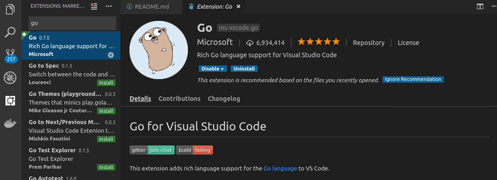
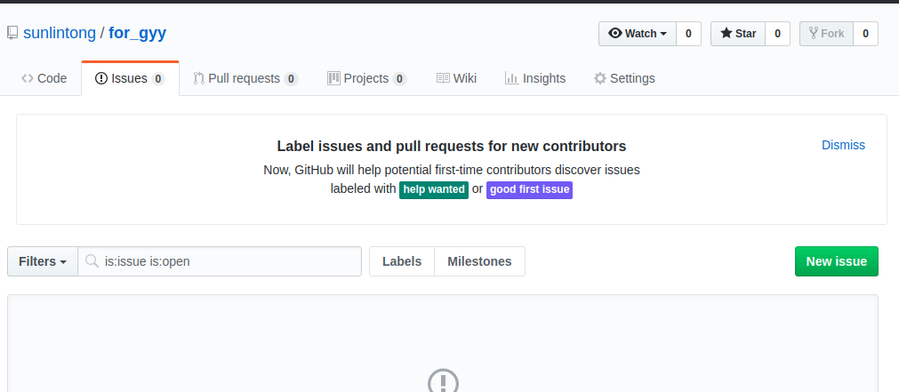

# Go Go Go 
## 简介
Go是一门跨平台、轻度面向对箱、高性能、适合装逼（暴露了）的语言，有java基础上手比较简单，哈哈哈，赶紧跟我一起学习哟

## hello world
### 安装宇宙第一IDE vscode(可以忽略此项。。)
`vscode`其实更像是一个文本编辑器，但它上面可以简单的安装丰富的插件，非常适合做go语言与前端开发
1. 下载对应安装OS的[vscode](https://code.visualstudio.com/#alt-downloads)
2. 打开`vscode`,安装`go`插件  

### 安装go开发环境
1. 下载安装对应OS的go安装包,哈哈哈，可以参考[菜鸟驿站](http://www.runoob.com/go/go-environment.html)
2. 配置`GOROOT`,`GOPATH`环境变量，并修改`PATH`环境变量

### 学习go 基本语法
配置开发环境和学习，可以参考[慕课网的教学视频](https://www.imooc.com/learn/968),也可以直接进行下一步，通过代码来熟悉go语言

### 目标
能写出简单的go程序并运行即可
## 基本数据结构（如果觉得掌握基本语法了可以不做这项，加快毕设进度，哈哈哈）
### 栈
用go实现基本的栈数据结构，可以参考姐姐去年学习时写的辣鸡代码T_T，那时代码不太规范，但勉强可以作为参考吧，哈哈哈
[go stack](https://github.com/sunlintong/train2/blob/master/stack.go)
### 链表
同上[go linklist](https://github.com/sunlintong/train2/blob/master/linkList.go)
### 目标
1. 通过手动写简单的数据结构，能对go语言cao dan 的语法不再抵触(hahah),大致理解go的编程思路
2. 期间会遇到很多问题，但不怕，有度娘和我在，所以一定要坚持哟

## web框架
go 有一个国人编写的开源web框架[beego](beego.me),它帮我们方便地编写后端接口，前端代码也可嵌入其中,我的毕设和平常的项目研发就用的它
### 安装beego
由于我没有用过mac，所以安装方面（包括安装go开发环境,我也不能详细说明，T_T，可恶)需要自己多摸索,由于GFW的原因，可能一些go package(比如beego,bee)无法go get下来，到时候可以叫我帮你弄～
### beego hello world
参考[官方文档](https://beego.me/quickstart)使用`bee run`命令生成最简单的beego工程，理解其中逻辑
### 进一步学习
1. 使用beego 框架写几个简单的后端接口,随便返回一些json数据，嘻嘻
2. 如果毕设打算使用数据库的话，一般可以使用`mysql`，可以参考教程安装，也可以使用`docker`一键安装mysql
3. 这时可以写一点小功能啦，如登录注册（数据需存入数据库哟),完成前后端交互

## 到这时，基本上毕设就没问题啦，路漫漫其修远兮，按心里所想，把毕设整的花里胡哨的就行了，啊哈哈哈哈  

备注:
- 如果有兴趣的话，希望能先学习`git`,对毕设的版本控制，以及工作后都相当有帮助
- `github`使用的就是git,可以先注册一个`github`账号，然后使用`git`不断将代码推送至`github`
- `git`的学习可以参考[廖雪峰官方网站](https://www.liaoxuefeng.com/wiki/0013739516305929606dd18361248578c67b8067c8c017b000)
- 有任何问题，可以在如下图的地方提issue哟，我也可以更新文档滴！  

